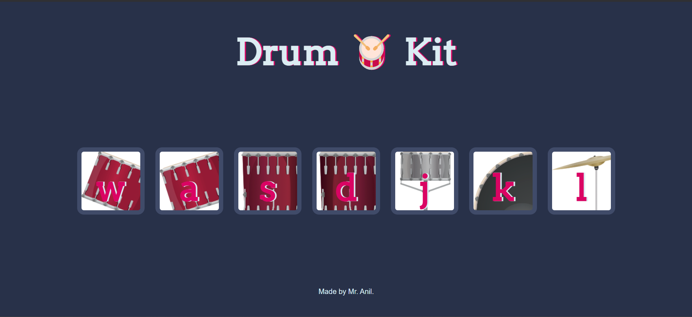

# 🥁 Drummer  

## 📌 Overview  
Drummer is a simple web-based **drum kit simulator** built with HTML, CSS, and JavaScript. Users can press specific keys (`W`, `A`, `S`, `D`, `J`, `K`, `L`) on their keyboard to play corresponding **drum sounds**, and an **animation effect** is applied to indicate the key press.  

## 🌐 Live Demo  
🔗 **Try It Here:** [Click to Play](https://anilsol159.github.io/drummer-html-css-js/)  

## 🖼 Screenshot  
  

## 🚀 Features  
- **Interactive Key Press:** Pressing `W, A, S, D, J, K, L` triggers different drum sounds  
- **Visual Feedback:** Keys get an animation effect when pressed  
- **Realistic Drum Sounds:** Uses pre-recorded drum audio files  
- **Simple and Responsive UI**  

## 🛠 Installation  

1. Clone this repository:  
   ```bash
   git clone <repo-url>
   cd <repo-folder>
